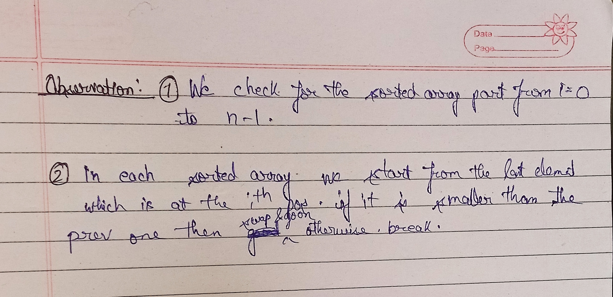

# Sorting

## 1. Selection Sort

1. Finds the smallest element in the unsorted part of the array.
2. Places it at the start of the unsorted section.
3. Repeats for the rest of the array.

So, in each pass: One element is placed in its correct final position.


#CODE;
```
#include<bits/stdc++.h>

using namespace std;
void selection_sort(int arr[], int n) {
  // selection sort
  for (int i = 0; i < n - 1; i++) {
    int mini = i;
    for (int j = i + 1; j < n; j++) {
      if (arr[j] < arr[mini]) {
        mini = j;
      }
    }
    int temp = arr[mini];
    arr[mini] = arr[i];
    arr[i] = temp;
  }

  cout << "After selection sort: " << "\n";
  for (int i = 0; i < n; i++) {
    cout << arr[i] << " ";
  }
  cout << "\n";

}
int main() {
  int arr[] = {13,46,24,52,20,9};
  int n = sizeof(arr) / sizeof(arr[0]);
   cout << "Before selection sort: " << "\n";
   for (int i = 0; i < n; i++) {
    cout << arr[i] << " ";
  }
  cout << "\n";
  selection_sort(arr, n);
  return 0;
}


Output:

Before selection sort:
13 46 24 52 20 9
After selection sort:
9 13 20 24 46 52
```

**Time complexity:** Selection Sort always takes O(N²) time in best, worst, and average cases.
The outer loop runs N−1 times, and the inner loop runs decreasingly from N−1 to 1, giving (N-1) + (N-2) + .... + 1 = N(N-1)/2

**Space Complexity:** O(1)


## 2. Bubble Sort

Bubble Sort repeatedly traverses the array, compares adjacent elements, and swaps them if they’re in the wrong order. 

With each pass, the largest element among the unsorted section “bubbles up” to its correct position at the end.


**For optimization:**

Add a flag (e.g., swapped = false) before the inner loop.

Whenever you swap two elements, set swapped = true.

After the inner loop, check:

  If swapped is still false, break out — no more passes are needed.

<br>

**Time complexity:** O(N²) (where N = size of array)

The outer loop runs about N times.

The inner loop runs fewer times each pass:

1st pass → N-1 times
2nd pass → N-2 times
…
Last pass → 1 time

If we add them up:
(N−1)+(N−2)+…+2+1=N(N−1)/2

This simplifies to about N²/2 steps.

**Effect on optimization on time complexity:**
1. **Best case (already sorted):** Only one pass → O(N) time.
2. **Worst case:** Still O(N²) (when the array is reversed).

**Space Complexity:** O(1)


## 3. Insertion Sort

Insertion sort builds the sorted array one element at a time, by picking the next element and placing it in its correct position among the already-sorted part of the array.

**Steps:**
1. Start from the second element (index 1) — the first element is already sorted.
2. Compare the current element with the previous elements in the sorted portion.
3. Shift all elements greater than the current element one position to the right.
4. Insert the current element at the correct position.
5. Repeat until all elements are placed in order.



<br>

**Time Complexity:**

**Best case (Already sorted):** O(N) ; if the given array is already sorted, the outer loop will only run and the inner loop will run for times. 

**Worst case (Reverse sorted):** O(N²)

**Average case:** O(N²)

**Space Complexity:** O(1)


## 4. Merge Sort

- A Divide and Conquer algorithm.

- Recursively splits the array into halves until each subarray has one element.


-  Merges the sorted subarrays back together.


**Algorithm:**

```
MergeSort(arr, low, high)
{
  if(low>=high) 
        return;

  mid = (low+high)/2
  MergeSort(arr, low, mid)
  MergeSort(arr, mid+1, high)
  merge(arr, low, mid, high)
}

```

<br>

```
void merge(vector <int> &arr, int low, int mid, int high){
    int left = low;
    int right = mid+1;
    vector<int> temp;

    while (left<=mid && right<=high)
    {
        if(arr[left]<=arr[right]){
            temp.push_back(arr[left]);
            left++;
        }
        else{
            temp.push_back(arr[right]);
            right++;
        }
    }

    //if elements are left in left array
    while(left<=mid){
        temp.push_back(arr[left]);
        left++;
    }
    
    //if elements are left in right array
    while(right<=high){
        temp.push_back(arr[right]);
        right++;
    }

    //transfeering the temp eleemts to arr
    for (int i = low; i <=high; i++)
    {
        arr[i] = temp[i-low];
    }
    
}

```

**Time Complexity:** O(nlogn) 

Reason: At each step, we divide the whole array, for that logn and we assume n steps are taken to get sorted array, so overall time complexity will be nlogn

**Space complexity:** O(n)  

## 5. Quick Sort

- Quick sort is a divide-and-conquer algorithm.

**Steps**
1. Pick a pivot (common choices: first element, last element, middle element, or random).

2. Partition the array so that:

  - All elements smaller than or equal to pivot go to its left.

  - All elements greater go to its right.

3. Recursively apply quick sort on the left and right partitions.

**Example:**

              arr = 8 3 4 9 2

              pivot = first element = 8

              partition → 3 4 2 | 8 | 9

              partition index = 3


**Algorithm:**

```
quick_sort(vector<int> &arr, int low, int high){
    if(low<high){
        int partition_index = partition(arr, low, high);
        quick_sort(arr, low, partition_index-1);
        quick_sort(arr, partition_index+1, high);
    }
}
```

```
int partition(vector<int> &arr, int low, int high){
    int pivot = arr[low];
    int i = low;
    int j = high;
    
    while(i<j){

        //find the larger element in left side
        while (arr[i]<=pivot && i<=high-1)
        {
            i++;
        }
        
        //find the smaller element in right side
        while(arr[j]>pivot && j>=low+1){
            j--;
        }

        if (i<j)
        {
            swap(arr[i],arr[j]);
        }
        
    }
    swap(arr[low], arr[j]);
    return j;
}
```

**Time Complexity:** 

Best Case: O(nlogn) 

Average Case: O(nlogn) 

Worst Case:	O(n^2)


**Space complexity:**

Best Case: O(logn)  [due to recursion stack]

Worst Case:	O(n)    [due to unbalanced partitioning leading to a skewed recursion tree]

## 6. Recursive Bubble Sort Algorithm

- The normal bubble sort uses two loops.

- In the recursive version, we:

    - Let recursion handle the outer loop (number of passes).

    - The inner loop still runs inside each recursive call to bubble the largest element to the end.


**Steps**
1. **Base case:** If the size of the array n is 1, it’s already sorted — return.

2. **Bubble pass:** Loop through the array from index 0 to n-2:

      - Compare arr[j] and arr[j+1].

      - Swap if out of order.

3. After this pass, the largest element is at the end.

4. Recursive call: Call the same function for n-1 elements (ignore last sorted element).


**Time Complexity:**

**Worst / Average case:** O(N²)

**Best case:** O(N) (if optimized with a flag to detect sorted array)

**Space complexity:** O(N) due to recursion stack.


## 7. Recursive Insertion Sort Algorithm

**Algorithm:**
1. **Base Case:** If pos == n-1, the array is sorted → return.

2. Starting from index pos, move backwards to 0:

    - Compare each element with its next element.

    - Swap if the previous element is greater.

    - If no swap occurs in an iteration, break early (best case optimization).

3. Call the function recursively for the next position: insertion_sort(arr, pos+1, n).

**Time Complexity:**

**Worst / Average case:** O(N²)

**Best case:** O(N) due to early break.

**Space complexity:** O(N)  for recursion stack (due to pos going from 0 → n-1).

